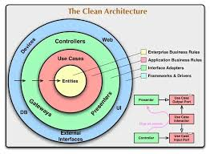

# Instructions for candidates

This is the .NET version of the Payment Gateway challenge. If you haven't already read this [README.md](https://github.com/cko-recruitment/) on the details of this exercise, please do so now. 

## Template structure
```
src/
    PaymentGateway.Api - a skeleton ASP.NET Core Web API
test/
    PaymentGateway.Api.Tests - an empty xUnit test project
imposters/ - contains the bank simulator configuration. Don't change this

.editorconfig - don't change this. It ensures a consistent set of rules for submissions when reformatting code
docker-compose.yml - configures the bank simulator
PaymentGateway.sln
```

Feel free to change the structure of the solution, use a different test library etc.


# Architecture Overview

The key design assumptions are based on concepts from **Clean Architecture**, **Hexagonal Architecture**, and **Domain-Driven Design (DDD)**.



## API Layer

API calls are centralized in **controllers** and are redirected to **use cases** using **MediatR**.  

## Use Cases

Use cases are responsible for orchestrating external resources and implementing business logic.  

## Domain Layer

The **domain layer** contains the core business rules and validation logic.  

- **Value Objects (VOs)** within the domain are used to optimize unit testing.

## Services Layer

The services layer relies on **interfaces**, which allows:

- Easy testing with mocks.
- Improved decoupling between components.
